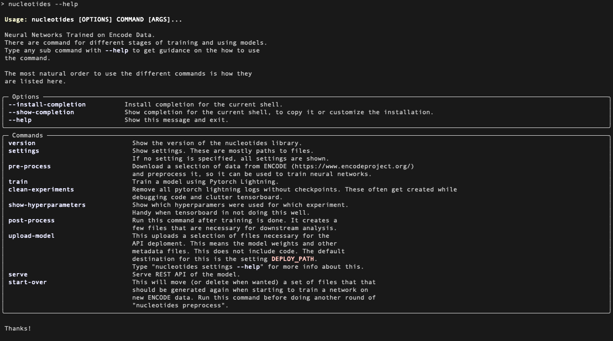
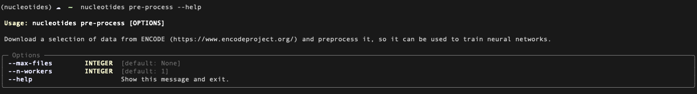
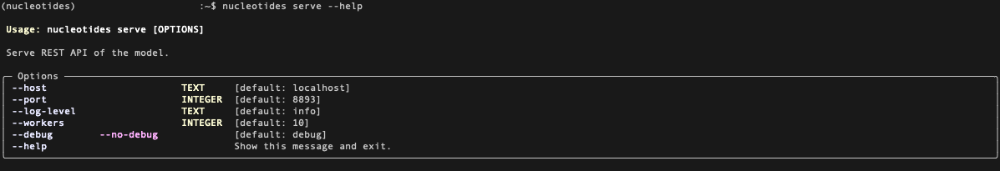
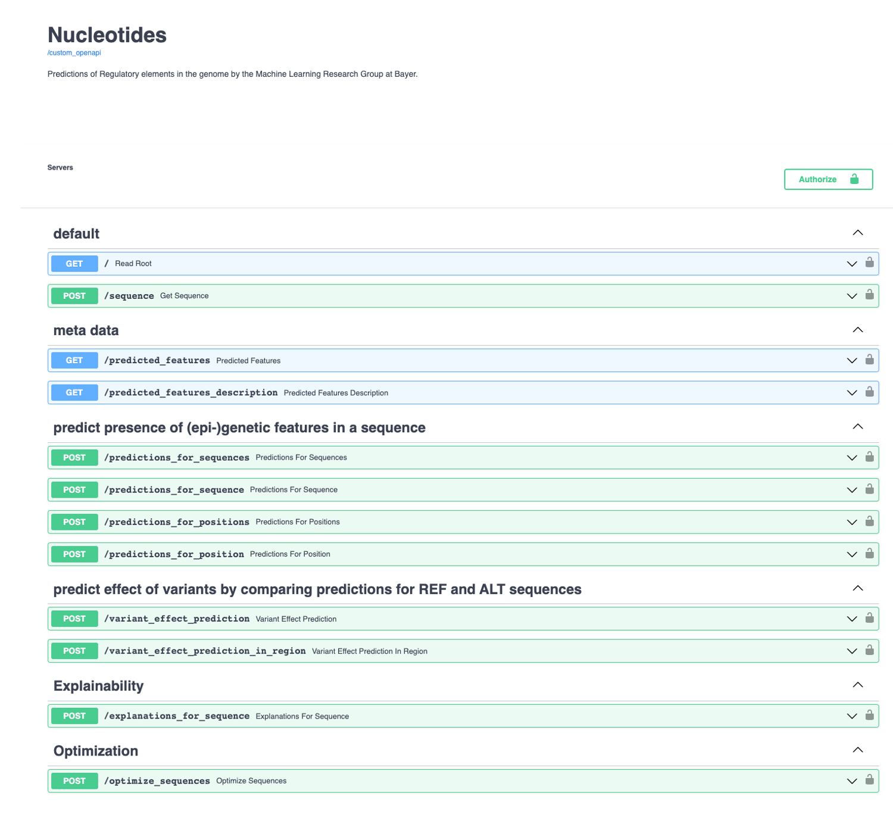
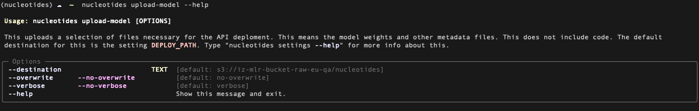
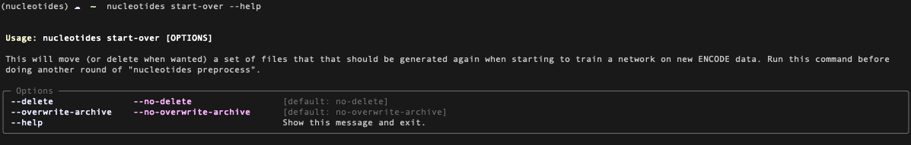

:confetti_ball: Nucleotides: Neural Networks Trained on ENCODE Data
===================================================================
[](https://github.com/psf/black)

This repoository contains code to train multi-task models on data obtained by experimentents such as
ChIP-seq, DNAse-seq and ATAC-seq.

The main source of data for such experiments is the ENCODE database (https://www.encodeproject.org/),
but of course custom experiments can be added as endpoints to be predicted.

Different variants of such models have been published. For example:

* Zhou, Jian, and Olga G. Troyanskaya. "Predicting effects of noncoding variants with deep learning–based sequence
  model."
  Nature methods 12, no. 10 (2015): 931-934. https://doi.org/10.1038/nmeth.3547
* Kelley, David R., Jasper Snoek, and John L. Rinn. "Basset: learning the regulatory code of the accessible genome with
  deep convolutional neural networks." Genome research 26, no. 7 (2016): 990-999. https://doi.org/10.1101/gr.200535.115
* Avsec, Žiga, Vikram Agarwal, Daniel Visentin, Joseph R. Ledsam, Agnieszka Grabska-Barwinska, Kyle R. Taylor, Yannis
  Assael, John Jumper, Pushmeet Kohli, and David R. Kelley. "Effective gene expression prediction from sequence by
  integrating long-range interactions." Nature methods 18, no. 10 (2021):
  1196-1203. https://doi.org/10.1038/s41592-021-01252-x

The code in this repo is mostly meant to facilitate the process of training these kinf of models, starting
with downloading data from ENCODE, training a model using [Pytorch Lightning](https://www.pytorchlightning.ai/),
doing some analysis, running explainabiliy methods on the models and serving different functionality using these
models up using a REST API.

For data loading the great Selene SDK (https://selene.flatironinstitute.org/master/) is used a lot here.

## Install the conda environment

```bash
conda env create -f environment.yml
```

and activate:

```bash
conda activate nucleotides
```

## Using the command line interface

There is a command line interface exposing all the basic functions.

```bash
nucleotides --help
```



This should be a good starting point, also when you want to find your way around the code.
So is the code for the REST API in nucleotides/api/main.py by the way.

## Settings

There are a bunch of settings, mostly paths to files that will be created, check out
how the settings are auto-created in your case:

```bash
nucleotides settings
```


To change some of these settings (for example NUCLEOTIDES_GRCh38) there are three options, either:

1) Set an environment value manually before running a command:
    ```bash
    NUCLEOTIDES_GRCh38=/some/custom/path nucleotides [COMMAND]
    ```
2) Add a line to a .env file:
    ```bash
    NUCLEOTIDES_GRCh38=/some/custom/path
    ```
3) Change the value in [nucleotides/settings.py](nucleotides/settings.py)

For more information about settings management read the pydantic docs on this topic:
https://pydantic-docs.helpmanual.io/usage/settings/

## Downloading and Preprocessing Data

You can automatically download a subset of the ENCCODE data. What is downloaded is
dependent on two URLS, check out how they are set:

```bash
nucleotides settings META_DNASE_URL --no-verbose
nucleotides settings META_CHIP_URL --no-verbose
```

You can also add some bed files of your own. Do this **before** you trigger the
pre-processing, so everything will be nicely integrated.
To check out to which directory to add your bed files manually (or change that
setting) type:

```bash
nucleotides settings BED_MANUALLY_ADDED_DIR
```

If everything is ready, trigger the preprocessing. Optionally, you can use
multiple workers for this.

```bash
nucleotides pre-process
```



## Model Training

Model training is done with Pytorch Lightning. The following command just wraps
the training script and directly accepts all the Pytorch Lightning Trainer
arguments:

```bash
nucleotides train --help
```

Different models are implemented in the nucleotides/model directory and inherit
from nucleotides.model.lightning_model.FunctionalModel
[nucleotides.model.lightning_model.FunctionalModel](nucleotides/model/lightning_model.py).

## Loss Functions

Different losses are implemented in nucleotides/loss . For focal, "class balanced"
and "distribution balanced" losses, and another interesting paper about random weighting check:

* Lin, Tsung-Yi, Priya Goyal, Ross Girshick, Kaiming He, and Piotr Dollár. “Focal Loss for Dense Object Detection.” In
  2017 IEEE International Conference on Computer Vision (ICCV), 2999–3007, 2017. https://doi.org/10.1109/ICCV.2017.324.
* Cui, Yin, Menglin Jia, Tsung-Yi Lin, Yang Song, and Serge Belongie. “Class-Balanced Loss Based on Effective Number of
  Samples.” In 2019 IEEE/CVF Conference on Computer Vision and Pattern Recognition (CVPR), 9260–69, 2019.
  https://doi.org/10.1109/CVPR.2019.00949.
* Wu, Tong, Qingqiu Huang, Ziwei Liu, Yu Wang, and Dahua Lin. “Distribution-Balanced Loss for Multi-Label Classification
  in Long-Tailed Datasets.” In Computer Vision – ECCV 2020, edited by Andrea Vedaldi, Horst Bischof, Thomas Brox, and
  Jan-Michael Frahm, 162–78. Lecture Notes in Computer Science. Cham: Springer International Publishing, 2020.
  https://doi.org/10.1007/978-3-030-58548-8_10.
* Huang, Yi, Buse Giledereli, Abdullatif Köksal, Arzucan Özgür, and Elif Ozkirimli. “Balancing Methods for Multi-Label
  Text Classification with Long-Tailed Class Distribution.” arXiv, October 15, 2021. http://arxiv.org/abs/2109.04712.
* Lin, Baijiong, Feiyang Ye, Yu Zhang, and Ivor W. Tsang. “Reasonable Effectiveness of Random Weighting: A Litmus Test
  for Multi-Task Learning.” arXiv, July 27, 2022. http://arxiv.org/abs/2111.10603.

Code is adapted from the github repo belonging to the paper of Huang et al. https://github.com/Roche/BalancedLossNLP,
but pulled apart into different classes, which fitted this implementation better.

For training the type of loss can be set as a hyperparameter --loss_type. See
[nucleotides/loss/loss.py](nucleotides/loss/loss.py).

## Post-process

After models have been trained:

```bash
nucleotides post-process
```

to run some analytics and create a UMAP projection of the different endpoints (the last thing can technically
already be done after pre-processing and before training as this just requires the data loader).

## Serve a REST API that can be used to access your model

It might be handy to give others access to your model. You can serve up the
REST API created with FastAPI by typing:

```bash
nucleotides serve
```





A Dockerfile is included in this repo as well. This can help to serve these models
in production. Another command that helps here is:

```bash
nucleotides upload-model
```



This uplpoads a select number of files that is needed by the deployment. As the help message indicates the
destination path can either be set by
including *--destination* or setting the default destination. To change the default setting, check:

```bash
nucleotides settings DEPLOY_PATH
```

## Start Over

ENCODE is ever growing and there might be other reasons to train a new model. You can delete or archive
old files by using:



This moves files out of the way, but will also leave others in place so that
you don't have to download everything from scratch for instance.


-------------------------------------------------------------------
Made with :heart: by the Machine Learning Research group at Bayer.

